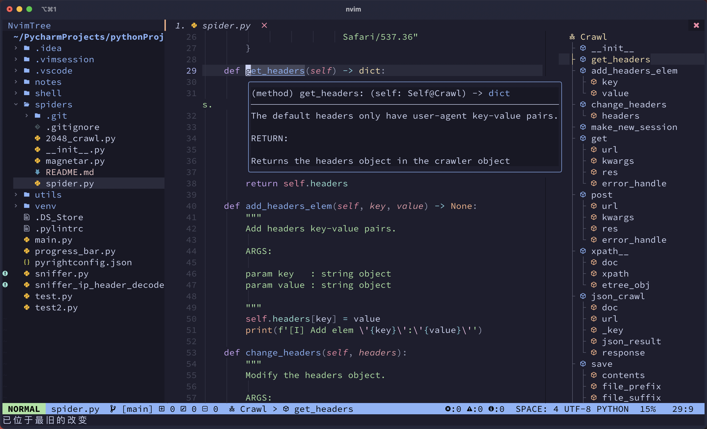
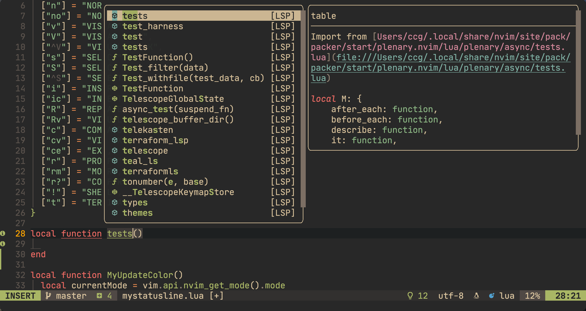
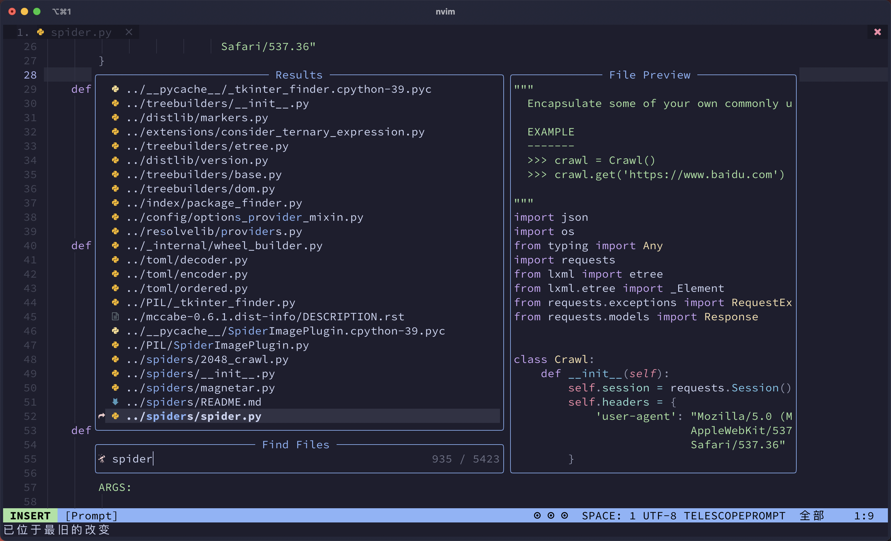

# DOTFILE

自用的nvim/vim,tmux等相关配置。

**!!! 将配置文件转为lua，用nvim自带的lsp替代coc**

- `init.lua`: nvim起始配置文件
- `IDEA` : IDEA等系列编辑器vim配置
- `coc` : coc配置文件
- `tmux` : tmux配置文件
- `Ultisnips` : 自定义的snips文件
- `vimL` : 旧的.vim配置
- `ftplugin`, `lua`, `plugin` : 配置文件的转lua后新建立的文件

